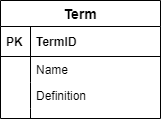
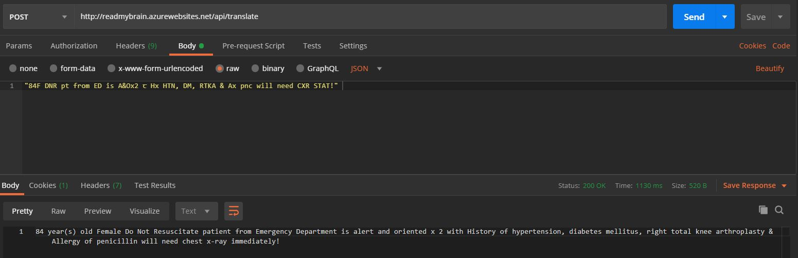
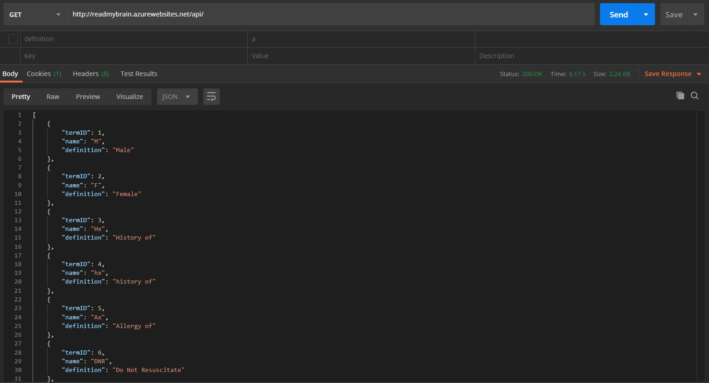
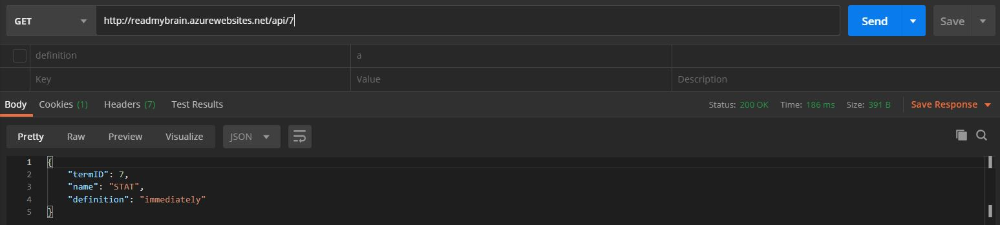
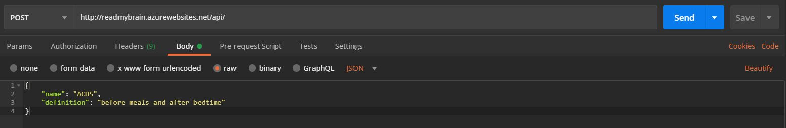
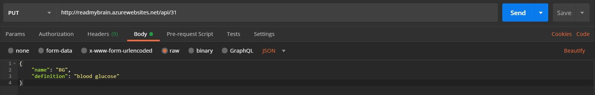

# [Read My Brain API](https://github.com/ayohana/read-my-brain-api.git/)

#### API for [Read My Brain](https://github.com/ayohana/read-my-brain.git/), 05.08.2020

#### By [**Adela Darmansyah**](https://github.com/ayohana/)

[About](#About) | [Documentation](#Documentation) | [Bugs](#Known-Bugs) | [Installation Instructions](#Installation-Instructions) | [Screenshots](#Screenshots)  | [Technologies](#Technologies) | [Resources](#Resources) | [Contact and Support](#Contact-and-Support) | [License](#License)

   

## About

**A service API for [Read My Brain](https://github.com/ayohana/read-my-brain.git/) to translate indecipherable nursing brain jargons into simple, readable text.**

## Documentation

Base URL: http://readmybrain.azurewebsites.net/api

| Operations                        | Method | Route | `Raw JSON Body` |
| :-------------------------------- | :----- | :---- | :-------- |
| Retrieve a list of all terms      | GET    | | |
| Retrieve a specific term by their ID | GET | `/{id}` | |
| Create a new term                 | POST   | | `{ "name": "VS", "definition": "vitals" }` |
| Update a term by their ID         | PUT    | `/{id}` | `{ "name": "VS", "definition": "Vital Signs" }` |
| Translate my brain                | POST   | `/translate` | `"84F DNR pt from ED is A&Ox2 c̅ Hx HTN, DM, RTKA & Ax pnc will need CXR STAT!"` |
| Delete a term by their ID         | DELETE | `/{id}` |  |

## Known Bugs

No known bugs at this time.

## Installation Instructions

### For local development:
* Download [.NET Core](https://www.learnhowtoprogram.com/c-and-net/getting-started-with-c/installing-c-and-net) (Mac/Windows OS) - _FREE!_
* Download [MySQL](https://www.learnhowtoprogram.com/c-and-net/getting-started-with-c/installing-and-configuring-mysql) (Mac/Windows OS) - _FREE!_
* Download [Postman](https://www.postman.com/downloads/) (Mac/Windows OS) - _FREE!_
* Clone this [repository](https://github.com/ayohana/read-my-brain-api.git/)
* Run the application by:
  * Entering `$ cd Desktop/read-my-brain-api/` to navigate into the `read-my-brain-api` directory 
    * Open `Startup.cs` and activate the correct configuration block of code for local development.
    * Enter the command `dotnet restore` to gather tools and dependencies for the application.
    * Enter the command `dotnet build` to build the project using its dependencies.
    * Enter the command `dotnet ef database update` to create a new database with seeded data. 
    * Enter `dotnet run` to run the application.
    * Enter URL `http://localhost:5000/api/` in Postman using one of the HTTP Methods [below](#HTTP-Methods-and-Routes). 

_Note: When running in Azure App Service, the connection string defined in Azure App Service takes precedence over the connection string defined in `appsettings.json`. For more details, click [here](https://docs.microsoft.com/en-us/azure/app-service/app-service-web-tutorial-dotnetcore-sqldb#configure-connection-string)._

## Screenshots

#### API Database Structure

#### Translate my brain

#### View all terms in Postman

#### View a term by ID

#### Add a new term

#### Update an existing term

## Technologies

* C#
* [.NET Core](https://dotnet.microsoft.com/download/dotnet-core/) (Windows OS)
* [MySQL](https://dev.mysql.com/downloads/file/?id=484919) (Windows OS)
* [EF Core](https://github.com/PomeloFoundation/Pomelo.EntityFrameworkCore.MySql)
* [Postman](https://www.postman.com/downloads/)
* [Azure App Service](https://azure.microsoft.com/en-us/services/app-service/)
* [Draw.io](https://app.diagrams.net/)

## Resources

* [Read My Brain](https://github.com/ayohana/read-my-brain.git/)
* [My Capstone Project Proposal](https://docs.google.com/document/d/1bxW7XzQk9xxoDU-CSc2oWtsvJcJJNuBybUBFhglaJDo/edit?usp=sharing)
* [Tutorial: Build an ASP.NET Core and SQL Database app in Azure App Service on Windows](https://docs.microsoft.com/en-us/azure/app-service/app-service-web-tutorial-dotnetcore-sqldb)
  * [Tenant API](https://github.com/ayohana/TenantAPI.git) - a successful test project for deploying SQL database and .NET app using Azure App Service
  * [Azure Tools for Visual Studio Code](https://marketplace.visualstudio.com/items?itemName=ms-vscode.vscode-node-azure-pack)
  * [Azure CLI on Windows](https://docs.microsoft.com/en-us/cli/azure/install-azure-cli-windows?view=azure-cli-latest#install-or-update)
* [Tutorial: Building an API](https://www.learnhowtoprogram.com/c-and-net/building-an-api)
* [Queries in LINQ to Entities: Method-Based Query Syntax](https://docs.microsoft.com/en-us/dotnet/framework/data/adonet/ef/language-reference/queries-in-linq-to-entities#method-based-query-syntax)
* [Strings in C# - Microsoft Documentation](https://docs.microsoft.com/en-us/dotnet/csharp/programming-guide/strings/)

## Contact and Support

Found a bug, broken feature or a brain fart? Let me know!

[adela.yohana@gmail.com](mailto:adela.yohana@gmail.com).

## License

This application is licensed under the MIT license.

Copyright (c) 2020 **Adela Darmansyah**